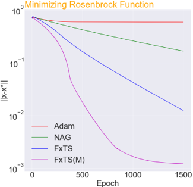
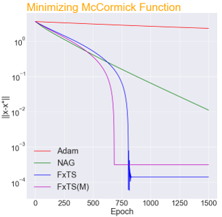
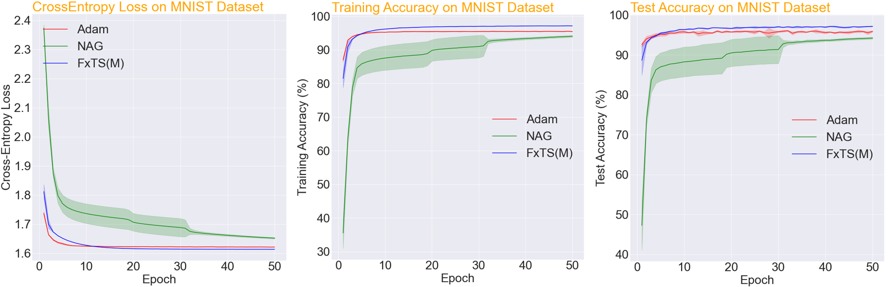
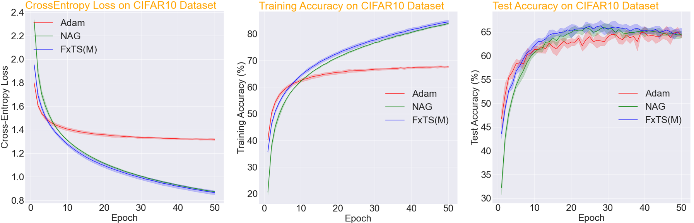

# FxTS-GF

This repository implements custom PyTorch optimizers for the Fixed-Time convergent Gradient Flows (FxTS-GF) proposed in our recent AAAI paper (https://arxiv.org/pdf/2112.01363.pdf) titled "Breaking the Convergence Barrier: Optimization via Fixed-Time Convergent Flows". The optimizer can be easily integrated by simply invoking:

```
optimizer = FxTS_Momentum(model.parameters(), lr=learning_rate, momentum=momentum)
```

Here is a quick summary of optimizer's performance for function minimization and training of NNs:

### Function minimization
 

### Training of CNN on MNIST dataset


### Training of CNN on CIFAR10 dataset



## How to cite

```
@article{budhraja2021breaking,
  title={Breaking the Convergence Barrier: Optimization via Fixed-Time Convergent Flows},
  author={Budhraja, Param and Baranwal, Mayank and Garg, Kunal and Hota, Ashish},
  journal={arXiv preprint arXiv:2112.01363},
  year={2021}
}
```
